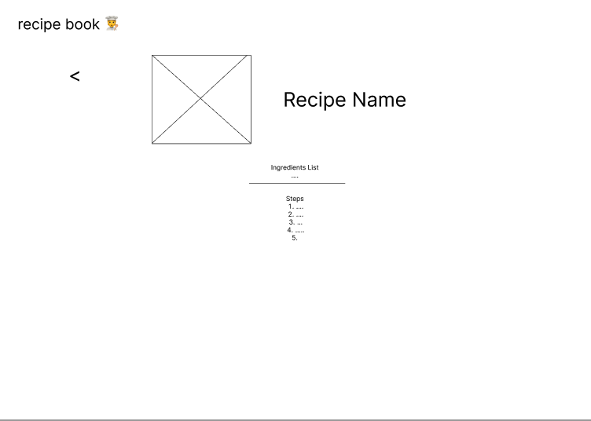

# recipe-book

## Requirements

- Searchable recipes on homepage, displayed in list
- Recipe display page

## Assumptions

- Recipes should have a title, ingredients list, picture url, info blurb, and steps
  - Typing definition:
    - `title: string`
    - `info: string`
    - `ingredients: string[]`
    - `picture: string`
    - `steps: string[]`

## Preliminary Mockups

## Approach

Components to flesh out:

- Homepage
  - NavLogo
  - Searchbar
    - incude button? or typeahead?
    - Use shadcn input and button
  - RecipeList
    - RecipeListItem
- Recipe Page
  - Can basically be one component unless complexity starts increasing
